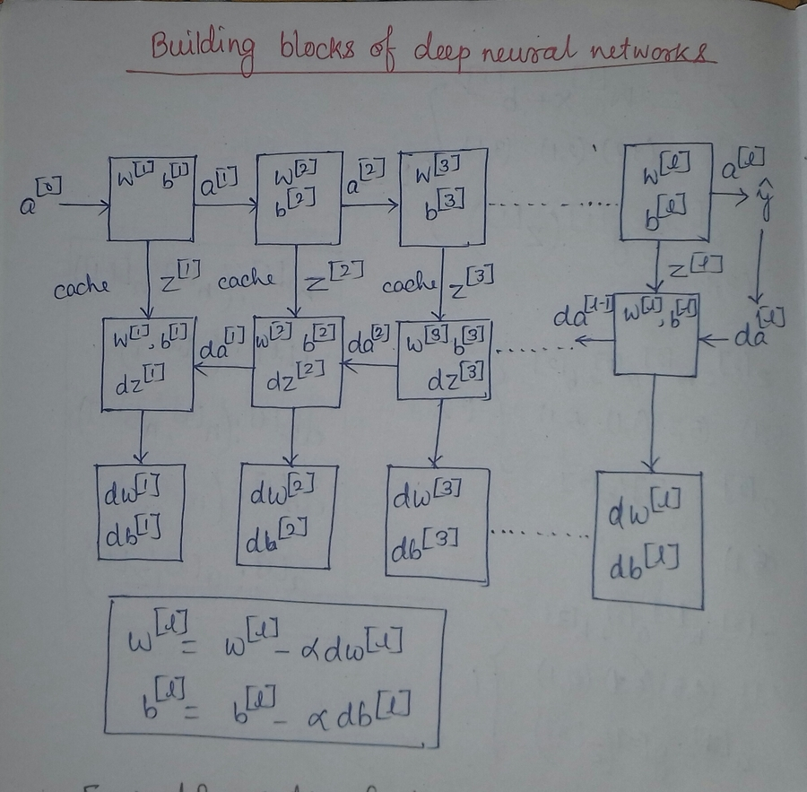

# Feed Forward Fully Connected Network
Deep feedforward networks, also often called feedforward neural networks, or multilayer perceptrons(MLPs), are the quintessential deep learning models. The goal of a feedforward network is to approximate some function **f***. For example, for a classifier, **y = f'(x)** maps an input x to a category y. A feedforward network defines a mapping **y = f(x;θ)** and learns the value of the parameters θ that result in the best function approximation.
These models are called feedforward because information flows through the function being evaluated from x, through the intermediate computations used to define f, and finally to the output y.There are no feedback connections in which outputs of the model are fed back into itself. When feedforward neural networks are extended to include feedback connections, they are called recurrent neural networks.
### Dependencies :
   * Python3
   * Numpy
### Feedforward Fully connected Neural Network example :


### Forward Propagation for layer L:
 
```
 Input  a[l-1]
 Output a[l], cache(Z[l])
  Z[l] = W[l] * a[l-1] + b[l]
  a[l] = g[l]( Z[l] )
 
 Where a[l] is the activation function at layer l
 
```
### Backpropagation for layer L :


```
 Error at output layer acts as input for backprop
 Y= Label vector in training set
 g'[l](Z[l]) = Derivative of g[l](Z[l])
 Input da[l] = a[l] - Y
 Output da[l-1], dW[l], db[l]
  dZ[l] = da[l] * g'[l](Z[l])
  dW[l] = dZ[l] * a[l-1]
  db[l] = dZ[l]
  da[l] = W[l] * dZ[l]
  dZ[l] = W[l+1]` * dZ[l+1] * g'[l](Z[l])
  
```
### Hyperparameters :
```
  epsilon= learning rate
  #iterations
  #hidden layers l
  #hidden units h[1],h[2]...
  Choice of activation functions :
     1) Sigmoid
     2) tanh
     3) Softplus
     4) Softsign
     5) Arctan
   Regularisation
```
### Dimension of parameters :
```
l=layer number
  W[l] : (n[l], n[l-l]) 
  b[l] : (n[l], 1) 
 dW[l] : (n[l], n[l-1])
 db[l] : (n[l], 1)
  a[l] : g[l](Z[l])
```

# WORKFLOW


### Reference :
 * Deeplearning.ai first course
